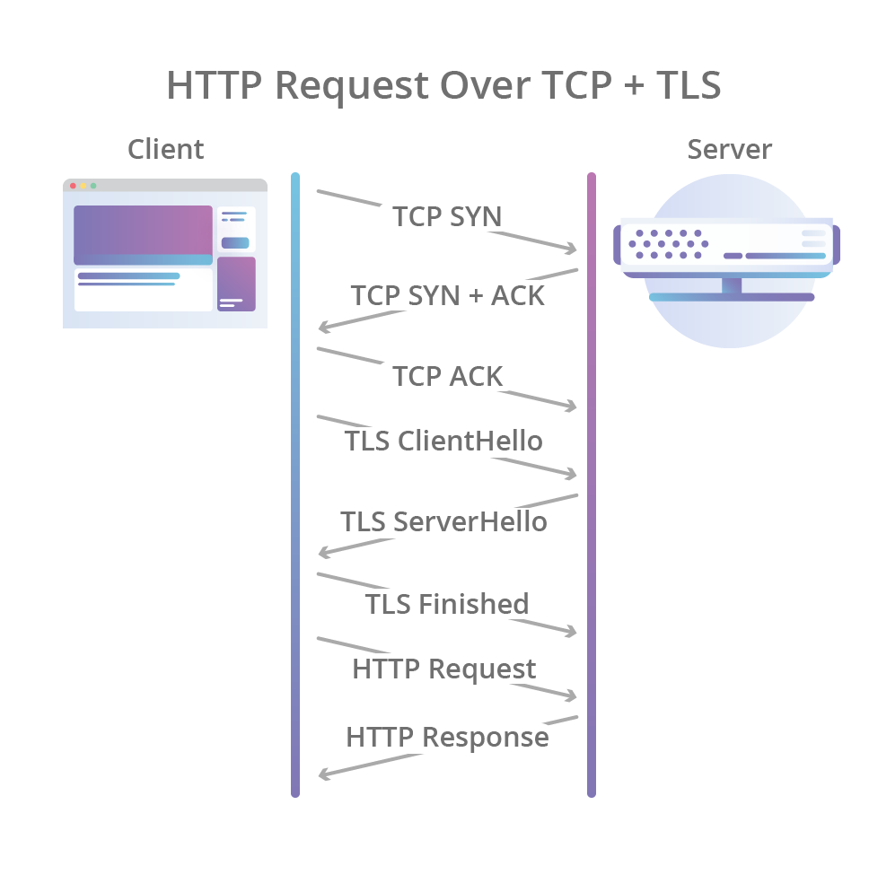

**Este resumen son anotaciones obtenidas de diversas fuentes que detallan conceptos relacionados a redes.**

Indice de contenidos:

- [Conceptos Importantes de Redes](#conceptos-importantes-de-redes)
- [Protocolos y modelo OSI](#protocolos-y-modelo-osi)
  - [Modelo OSI (Open System Interconnection)](#modelo-osi-open-system-interconnection)
  - [Protocolos mas importantes](#protocolos-mas-importantes)
- [Comando `ping`](#comando-ping)
- [Links utiles](#links-utiles)

# Conceptos Importantes de Redes

* **Red**: Una red es un grupo de dos o mas computadores conectados. 
* **Internet**: Es una red de redes, es decir, multiples redes de todo el mundo interconectadas entre sí. Internet es una **red de conmutación de paquetes**. La conmutación de paquetes se refiere a la capacidad de los equipos de red de procesar paquetes independientemente unos de otros. También significa que los paquetes pueden tomar diferentes rutas de red hacia el mismo destino, siempre que todos lleguen al mismo. Gracias a la conmutación de paquetes, los paquetes de varios ordenadores pueden viajar por los mismos cables en cualquier orden. Esto permite que se produzcan multiples conexiones a través del mismo equipo de red al mismo tiempo. Como resultado, pueden intercambiar datos en internet de millones de dispositivos a la vez, en lugar de solo unos pocos.

  **OBS:** En determinados protocolos, los paquetes sí deben llegar a sus destinos finales en el **orden correcto**, aunque cada paquete haya tomado una ruta diferente para llegar.

* **Internet Service Provider (ISP)**: Un proveedor de servicios de internet es una empresa que se dedica a ofrecer servicios de acceso a internet a sus clientes.
* **Paquete**: Un paquete es un pequeño segmento de un mensaje más grande. Los datos enviados a través de redes informáticas, como internet, se dividen en paquetes. Estos paquetes los vuelve a combinar el ordenador o el dispositivo que los recibe. Todos los paquetes de red incluyen un encabezado para que el dispositivo que los recibe sepa de dónde vienen los paquetes, para qué son y cómo procesarlos. Los paquetes constan de dos partes: el **encabezado** y la **carga util**. El **encabezado** contiene información sobre el paquete, como sus direcciones IP de origen y de destino, este va al principio de cada paquete. La **carga util** son los datos reales.

  Usualmente los paquetes tienen más de un encabezado, y cada encabezado lo utiliza una parte diferente del proceso de red. Los encabezados de los paquetes los adjuntan ciertos tipos de protocolos de red. Algunos de estos protocolos añaden encabezados a los paquetes con información asociada a ese protocolo. Como mínimo, la mayoría de los paquetes que surcan internet incluirán un encabezado del protocolo TCP y otro del IP. Así, por ejemplo, un paquete con un encabezado de IP puede denominarse **paquete IP**. Un encabezado de IP contiene información importante sobre la procedencia de un paquete (su dirección IP de origen), a donde va (dirección IP de destino), el tamaño del paquete y el tiempo que los enrutadores de la red deben seguir reenviando el paquete antes de desecharlo. También puede indicar si el paquete puede ser fragmentado o no, e incluir información sobre la reagrupación de paquetes fragmentados.
  * Un **datagrama** es un segmento de datos enviado a través de una red de conmutación de paquetes. Un datagrama contiene suficiente información para ser enrutado desde su origen hasta su destino. Según esta definición, un paquete de IP es un ejemplo de datagrama. En esencia, datagrama es un término alternativo para paquete.
* **Tráfico de red**: Término que hace referencia a los paquetes que pasan por una red.
* **Enrutador (Router)**: Un router es un dispositivo que conecta dos o mas redes o subredes de conmutación de paquetes. Cumple dos funciones principales: gestionar el tráfico entre estas redes mediante el reenvío de paquetes de datos a sus direcciones IP previstas, y permite que varios dispositivos utilicen la misma conexion a internet.

  Hay varios tipos de routers, pero la mayoría de ellos pasan datos entre las **LAN (redes de área local)** y las **WAN (redes de área amplia)**. Una LAN es un grupo de dispositivos conectados restringidos a una zona geográfica concreta. Una LAN suele necesitar un solo router. En cambio, una WAN es una gran red extendida por una amplia zona geográfica. Por ejemplo, las grandes organizaciones y empresas que opran en varios lugares del país necesitarán redes LAN separadas para cada lugar, que luego se conectan a las otras LAN para formar una WAN. Ya que  una WAN está distribuida por una zona grande, suele necesitar varios routers y conmutadores.

    * Un **conmutador de red** reenvía paquetes de datos entre grupos de dispositivos de la misma red, mientras que un router reenvía datos entre redes diferentes.
    * Un router y modem no son lo mismo, aunquee los ISP pueden combinar ambos en un mismo dispositivo. Un router forma redes y gestiona el flujo de datos dentro de esas redes y entre ellas, mientras que un **modem** conecta esas redes a internet. Los modem forjan una conexión a internet al convertir las señales de un ISP en una señal digital que puede ser interpretada por cualquier dispositivo conectado.

      **OBS**: Un solo dispositivo puede conectarse a un modem para conectarse a internet; de forma alternativa, un router puede ayudar a distribuir esta señal a múltiples dispositivos dentro de una red establecida, permitiendo que todos ellos se conecten a internet simmultáneamente.
* **Dirección IP**: Identificador único asociado a un dispositivo y necesario para la comunicación en la red. El protocolo IP se encarga de asignar números IP a todos los dispositivos que acceden a internet. 

  Cuando un usuario escribe un nombre de dominio, como `google.com` en un navegador web, iniciará una solicitud para que el servidor web de Google solicite contenido (la pagina de inicio de Google). Una vez que Google recibe la solicitud, necesita saber de dónde enviar el contenido del sitio web. Por esta razón, la solicitud incluirá la dirección IP del solicitante. La dirección IP proporcionada permite a Google enviar una respuesta al dispositivo del usuario que a continuación mostrará ese contenido en el navegador web del usuario.

  

  * **Diferencias entre IPv4 e IPv6**: IPv4 e IPv6 son versiones diferentes del protocolo de internet (IP). IPv4 se implementó en 1983 y sigue en uso hoy en día. El formato de las direcciones IPv4 es de cuatro conjuntos de números separados por puntos, por ejemplo: `64.125.224.72`. Es un formato de 32 bits, lo que significa que permite $2^{32}$ (aprox. 4.300 millones) de direcciones IP únicas que, sin embargo, es escaso para la cantidad de dispositivos que se encuentran conectados a internet en el presente. La necesidad de más direcciones IP promovió la implementación de IPv6. Las direcciones IPv6 utilizan un formato más complejo de conjuntos de números y letras separados por dos puntos, únicos o dobles, por ejemplo: `2607:f860:4005:804::200e`. Este formato de 128 bits puede admitir $2^{128}$ direcciones únicas. Adicionalmente, IPv6 ofrece mejoras de seguridad y privacidad. A pesar de las diferencias, tanto IPv4 como IPv6 se han utilizado simultáneamente en la web. Las dos versiones pueden trabajar en paralelo, pero se tuvo que aplicar medidas especiales para facilitar las comunicaciones entre dispositivos IPv4 e IPv6.

  **OBS:** IPv5 era un protocolo experimental de transmisión de datos que nunca se implementó, este utilizaba el mismo formato de 32 bits que IPv4.

  * **Diferencias entre IP estáticas y dinámicas**: El suministro limitado de direcciones IPv4 propició la aplicacián de la asignación dinámica de direcciones IP. A la mayoría de los dispositivos conectados a internet se les asignan direcciones de IP temporales. Por ejemplo, cuando un usuario particular se conecta a internet con su notebook, el ISP de ese usuario le asigna una dirección IP temporal desde un conjunto de direcciones IP compartidas. Esto se conoce como una **dirección IP dinámica**. Es más rentable para el ISP que asignar a cada usuario una **dirección IP permanente o estática**. Las empresas grandes pagan a los ISP para mantener una dirección IP estática, para así no tener fallas en las consultas DNS hacia esa dirección IP.

* **Nombre de dominio**: Un nombre de dominio es una cadena de texto que se asigna a una dirección IP numérica, que se utiliza para acceder a un sitio web desde el software del cliente.
* **Domain Name System (DNS)**: El sistema de nombres de dominio es el directorio telefónico de Internet. Las personas acceden a la información en línea a través de nombres de dominio como `Google.com`. Los navegadores web interactúan mediante direcciones de Protocolo de Internet. El DNS traduce los nombres de dominio a dirección IP para que los navegadores puedan cargar los recursos de internet. Existen 4 servidores DNS implicados en la carga de un sitio web:
  * **Recursor de DNS**: Es como un bibliotecario, el recursor DNS es un servidor diseñado para recibir consultas desde equipos cliente mediante aplicaciones como navegadores web. Normalmente, el recursor DNS será el responsable de hacer solicitudes adicionales para satisfacer la consulta de DNS del cliente.
  * **Servidor de nombres raiz**: Es el primer paso para traducir (solucionar) los nombres de servidor legibles en direcciones IP. Se puede comparar a un indice en una biblioteca. Generalmente sirve como referencia de otras ubicaciones mas especificas.
  * **Servidor de nombres TLD**: El servidor de dominio de nivel superior (**TLD, Top Level Domain**) se puede comparar con una estanteria de libros en una biblioteca. Es el paso siguiente en la busqueda de una direccion IP especifica y aloja la ultima parte de un nombre de servidor (por ejemplo, en `Google.com`, el servidor TLD es `.com`).
  * **Servidor de nombres autoritativo**: Se puede interpretar como un diccionario en una estanteria de libros, en el que se puede consultar la definicion de un nombre especifico. El servidor de nombres autoritativo es la ultima parada en la consulta del servidor de nombres. Si cuenta con acceso al registro solicitado, devolverá la direccion IP del nombre del servidor solicitado al recursor de DNS que hizo la solicitud inicial.

* **Internet Socket**: Un socket es un punto final de un enlace de comunicacion bidireccional entre dos programas que se ejecutan en la red (enviar y recibir datos a traves de la red). Un socket está vinculado a un numero de puerto para que la capa TCP pueda identificar la aplicacion a la que se envian los datos.
  * Un socket queda definido por un par de direcciones IP local y remota, un protocolo de transporte y un par de numeros de puerto local y remoto.
* **Round trip time (RTT)**: El tiempo de ida y vuelta (RTT) es el tiempo que tarda un paquete de datos en enviarse a un destino más el tiempo que tarda el receptor en enviar un mensaje acusando el recibo de este paquete.
* **Jitter**: Concepto utilizado para referirse a la demora en el tiempo de envio de un paquete de datos a traves de la conexion de red. Usualmente ocurre por una congestion en la red.
* **Bandwidth**: Cantidad maxima de datos transmitidos a traves de una conexion a internet en un periodo de tiempo determinado. El ancho de banda suele confundirse con la **velocidad del internet**, sin embargo es el volumen de informacion que puede enviarse a traves de una conexion en un periodo de tiempo medido, calculado en megabits por segundo (Mbps).
* **VoIP**: Metodo que permite hacer llamadas de voz utilizando una conexion a internet de banda ancha en lugar de una linea telefonica normal (Ej: Skype, Whatsapp).
* **TCP Three-Way HandShake (TCP 3-way)**: Es un proceso que se utiliza en una red TCP/IP para establecer una conexion entre el servidor y el cliente. Es un proceso de tres pasos que requiere que tanto el cliente como el servidor intercambien paquetes de sincronizacion y reconocimiento antes de que comience el proceso real de comunicacion de datos, luego de esto se establece formalmente la conexion (ver explicacion protocolo TCP para mayor informacion).
* **Virtual Private Network (VPN)**: Una red privada virtual es un servicio de seguridad que permite que los usuarios accedan a Internet como si estuvieran conectados a una red privada. Esto encripta las comunicaciones de internet, ademas de proporcionar un alto grado de anonimato. Una conexion VPN implica los siguientes 4 pasos:
  * El cliente VPN se conecta al ISP mediante una conexion encriptada.
  * El ISP conecta al cliente VPN con el servidor VPN, mantiendo la conexion encriptada, asi el ISP no puede ver la actividad del usuario.
  * El servidor VPN descifra los datos del dispositivo del usuario y, a continuacion, se conecta a internet para acceder al servidor web en una comunicacion no encriptada.
  * El servidor VPN crea una conexion encriptada con el cliente, que se conoce como **tunel VPN**. Las comunicaciones del servidor VPN con internet no estan encriptadas, pero los servidores web solo registraran la direccion IP del servidor VPN, lo cual no les da informacion alguna sobre el usuario.

# Protocolos y modelo OSI

En redes, un **protocolo** es una forma estandarizada de realizar determinadas acciones y de dar formato a los datos para que dos o mas dispositivos puedan comunicarse y entenderse entre si, en simples palabras es un conjunto de reglas para formatear y procesar datos.

En internet hay diferentes protocolos para diferentes tipos de procesos. Con frecuencia, se habla de los protocolos en funcion de la capa del modelo OSI a la que pertenecen.

## Modelo OSI (Open System Interconnection)

El modelo de interconexion de sistemas abiertos es un modelo conceptual, creado por la ISO, que permite que diversos sistemas de comunicacion se comuniquen usando protocolos estandar. El modelo OSI es una representacion abstracta del funcionamiento de Internet, contiene 7 capas, y cada una de estas representa una categoria diferente de funciones de red. Cada capa del modelo OSI tiene una funcion especifica y se comunica con las capas superiores e inferiores.

Los protocolos hacen posible estas funciones de red. Por ejemplo, el Protocolo de Internet (IP) es el responsabe de enrutar los datos indicando de donde vienen los paquetes de datos y cual es su destino. El IP hace posible las comunicaciones entre redes. Por ello, el IP se considera un protocolo de **capa de red (red layer)**. Por otra parte, el Procotolo de control de transmision (TCP) asegura que el transporte de datos en redes se realice sin problemas, por tanto, el TCP se considera un protocolo de la **capa de transporte (transport layer)**.

* **Capa de aplicacion (Aplication Layer)**: Esta es la unica capa que interactua directamente con los datos del usuario. Las aplicaciones de software, como navegadores web y clientes de correo electronico, dependen de la capa de aplicacion para iniciar comunicaciones. Sin embargo, debe quedar claro que las aplicaciones de software cliente no forman parte de la capa de aplicacion; mas bien, la capa de aplicacion es responsable de los protocolos y la manipulacion de datos de los que depende el software para presentar datos significativos al usuario. Los protocolos de esta capa incluyen HTTP, asi como tambien SMTP (el Protolo simple de transferencia por correo electronico, uno de los protocolos que permiten las comunicaciones por este medio).
  
  

* **Capa de presentacion (Presentation Layer)**: Esta capa es principalmente responsable de preparar los datos para que los pueda usar la capa de aplicacion; en otras palabras, esta capa hace que los datos se preparen para su comsumo por las aplicaciones. La capa de presentacion es responsable de la traduccion, el cifrado y la compresion de datos.
  * Dos dispositivos de comunicacion que se conectan entre si podrian estar usando distintos metodos de codificacion, por lo que esta capa es la responsble de traducir los datos entrantes en una sintaxis que la capa de aplicacion del dispositivo receptor pueda comprender. Si los dispositivos se comunican a traves de una conexion cifrada, esta capa es la responsable de añadir el cifrado en el extremo del emisor, asi como de decodificar el cifrado en el extremo del receptor, para poder presentar a la capa de aplicacion datos descifrados y legibles. Despues, la capa de presentacion es tambien la encargada de comprimir los datos que recibe de la capa de aplicacion antes de ser enviados a la capa de sesion. Esto ayuda a mejorar la velocidad y eficiencia de la comunicacion mediante la minimizacion de la cantidad de datos que serán transferidos.
   
  

* **Capa de sesion (Session Layer)**: La capa de sesion es la responsable de la apertura y cierre de comunicaciones entre dos dispositivos. Ese tiempo que transcurre entre la apertura de la comunicacion y el cierre de esta se conoce como sesion. La capa de sesion garantiza que la sesion permanezca abierta el tiempo suficiente como para transferir todos los datos que se estan intercambiando; tras esto, cerrará sin demora la sesion para evitar desperdicio de recursos.

  La capa de sesion tambien sincroniza la transferencia de datos utilizando puntos de control. Por ejemplo, si un archivo de 100 MB está transfiriendose, la capa de sesion podria fijar un punto de control cada 5 MB. En caso de desconexion o caida tras haberse transferido, por ejemplo, 52 MB , la sesion podria reiniciarse a partir del ultimo punto de control, con lo cual solo quedarian unos 50 MB pendientes de transmision. Sin estos puntos de control, la transferencia en su totalidad tendria que reiniciarse desde cero.

  

* **Capa de transporte (Transport Layer)**: Esta capa es la responsable de las comunicaciones de extremo a extremo entre dos dispositivos. Esto implica, antes de proceder a ejecutar el envio a la capa de red, toma datos de la capa de sesion y los fragmenta seguidamente en trozos mas pequeños llamados segmentos. La capa de transporte del dispositivo receptor es la responsable luego de rearmar tales segmentos y construir con ellos datos que la capa de sesion pueda consumir.

  La capa de transporte es tambien la responsable del **control de flujo y del control de errores**. El **control de flujo** sirve para determinar la velocidad optima de transmision que garantice que un emisor con velocidad de conexion alta no congestione a un receptor cuya conexion sea lenta. La capa de transporte realiza un **control de errores** en el extremo receptor consistente en asegurarse de que todos los datos recibidos estén completos, y solicitará el reenvio en caso de que no.

  

* **Capa de red (Network Layer)**: La capa de red es la responsable de posibilitar las transferencias de datos entre dos redes diferentes. Si los dos dispositivos que se comunican están en la misma red, entonces no hará falta esta capa de red. La capa de red lo que hace es fragmentar, en el dispositivo emisor, los datos de la capa de transporte en unidades mas pequeñas llamadas paquetes y rearmarlos despues en el dispositivo receptor. La capa de red tambien busca el mejor camino fisico para que los datos lleguen a su destino, esto se conoce como enrutar.

  

* **Capa de enlace de datos (Datalink Layer)**: La capa de enlace de datos es muy similar a la capa de red, salvo que lo que hace es facilitar la transferencia de datos entre dos dispositivos ubicados en una **misma red**. La capa de enlace de datos toma los paquetes de la capa de red y los rompe en trozos mas pequeños denominados tramas. Al igual que la capa de red, la capa de enlace de datos es tambien la responsable del control de flujo y de errores respecto de esa comunicacion dentro de la red (la capa de transporte solo realiza esto ultimo respecto de comunicaciones entre redes).

  

* **Capa fisica (Physical Layer)**: Esta capa incluye los dispositivos fisicos que participan en la transferencia de datos, como los cables. Se trata tambien de la capa en la que los datos se convierten en una secuencia de bits. La capa fisica de ambos dispositivos debe consensuar ademas una convencion de señales que permita distinguir los unos de los ceros en ambos dispositivos.

  

## Protocolos mas importantes

* **Internet Protocol (IP)**: El protocolo de Internet es un protocolo, o conjunto de reglas, para enrutar y direccionar paquetes de datos para que puedan viajar a traves de las redes y llegar al destino correcto. Los datos que atraviesan internet se dividen en trozos mas pequeños, llamados paquetes. La informacion IP se adjunta a cada paquete, y esta informacion ayuda a los enrutadores a enviar los paquetes al lugar correcto. A cada dispositivo o dominio que se conecta a internet se le asigna una direccion IP, y a medida que los paquetes se dirigen a la direccion IP adjunta, los datos llegan a donde se necesitan. Una vez que los paquetes llegan a su destino, se manejan de forma diferente en funcion del protocolo de transporte que se utilice en combinacion con IP. **Los protocolos de transporte mas comunes son TCP y UDP**.
* **Transmision Control Protocol (TCP)**: **Protocolo de comunicaciones** orientado a la conexión que facilita el intercambio de mensajes entre dispositivos informáticos en una red. Es el protocolo más común en las redes que utilizan el Protocolo de Internet (IP); juntos se denominan a veces TCP/IP.
  * IP es un protocolo sin conexion, lo que significa que cada unidad de datos se aborda individualmente y se enruta desde el dispositivo de origen al dispositivo de destino, el cual no envía una confirmacion de vuelta al origen. Ahí es donde entran en juego protocolos como el TCP. Este se utiliza en conjunto con IP para mantener una conexion entre el remitente y el destino y para garantizar que todos los paquetes lleguen en orden una vez que se inicia la transmision. Mediante TCP, el destinatario acusará recibo de cada paquete que llegue. Los paquetes faltantes se enviarán de nuevo si no se acusa recibo. 
  * TCP está diseñado para la fiabilidad, no para la velocidad. Como TCP tiene que asegurarse de que todos los paquetes lleguen en orden, la carga de datos mediante TCP/IP puede tardar mas si faltan algunos paquetes.

  * **Three-Way Handshake**: Por Ejemplo, cuando se envia un correo electronico a traves del protoco TCP, se establece una conexion y se realiza un protoclo de enlace de 3 vias:
    * En primer lugar, el origen envia un paquete de solicitud inicial **SYN** al servidor de destino para iniciar la comunicacion.
    * Luego, el servidor de destino envia un paquete **SYN-ACK** para aceptar el proceso.
    * Por ultimo, el origen envia un paquete **ACK** al destino para confirmar el proceso, tras lo que se puede enviar el contenido del mensaje.

    El mensaje de correo electronico se divide en ultima instancia en paquetes antes de que cada paquete se envie a internet, donde recorre una serie de puertas de enlace antes de llegar al dispositivo de destino donde el TCP reagrupa el conjunto de paquetes en el contenido original del correo electronico.

  

* **User Datagram Protocol (UDP)**: El protocolo de datagrama de usuarios es un **protocolo de comunicacion** que se utiliza en internet para transmisiones sujetas a limitaciones temporales, como la reproduccion de video o las busquedas en DNS. Acelera las comunicaciones al no establecer formalmente una conexion antes de transferir los datos, como sí lo hace TCP. Esto permite que los datos se transfieran muy rapido, pero tambien puede hacer que los paquetes se pierdan en transito (y crear oportunidades para vulnerabilidades en forma de ataques DDoS), pues no se asegura de que todos los paquetes se entreguen y estén en orden.

  

* **Internet Control Message Protocol (ICMP)**: El protocolo de control de mensajes de internet es un protocolo en la **capa de red** que utilizan los dispositivos de red para diagnosticar problemas de comunicacion en la red. El ICMP se utiliza principalmente para determinar si los datos llegan o no a su destino a su debido tiempo. El protocolo ICMP se suele utilizar en dispositivos de red, como los enrutadores. El ICMP es crucial para informar de errores y realizar pruebas. Este protocolo es utilizado por el comando de linux `ping` para comprobar la conectividad de red entre host/servidor y host. 

* **Secure Sockets Layer (SSL)**: Es un **protocolo de internet** basado en el cifrado (predecesor de TLS). 
  * Para ofrecer un alto grado de privacidad, SSL cifra los datos que se transmiten por la web.
  * SSL inicia un proceso de autenticacion, conocido como establecimiento de comunicacion, entre dos dispositivos que se comunican para garantizar que ambos sean lo que aparentan.
  * Ademas, SSL firma digitalmente los datos para proporcionar integridad de datos, que verifica que no se hayan manipulado los datos antes de alcanzar al destinatario designado.

  **OBS: SSL fue el protocolo de seguridad original desarrollado para HTTP, luego fue sustituido por TLS. Los protocolos de enlace SSL ahora se denominan protocolos de enlace TLS, aunque el nombre SSL sigue siendo muy utilizado.**

* **Transport Layer Security (TLS)**: Es un **protocolo de seguridad** diseñado para facilitar la privacidad y la seguridad de los datos en las comunicaciones por Internet. Un caso de uso primario de TLS es la encriptacion de las comunicaciones entre aplicaciones web y servidores, como los navegadores que cargan un sitio web. TLS tambien puede usarse para encriptar otras comunicaciones como el correo electronico, los mensajes y la voz sobre IP (VoIP). Existe tres componentes principales en las funciones del protocolo TLS:
  * **Encriptacion**: Oculta los datos que se transfieren a terceras partes.
  * **Autenticacion**: Garantiza que las partes que intercambian informacion sean quienes afirman ser.
  * **Integridad**: Verifica que los datos no han sido falsificados o alterados.
  * **Diferencias entre HTTPS y TLS**: HTTPS es una implementacion de la encriptacion TLS en el protocolo HTTP, usado por todos los sitios web asi como otros servicios web. Todos los sitios web que usan HTTPS emplean por tanto la encriptacion TLS.

  
  
  Un protocolo de enlace TLS es el proceso que inicia una sesion de comunicacion que utiliza TLS. Durante un protocolo de enlace TLS, las dos partes que se comunican intercambian mensajes para reconocerse y verificarse entre si, establecer los algoritmos de criptografia que utilizarán y acordar claves de sesion. Los protocolos de enlace TLS son una parte fundamental del funcionamiento de HTTPS. Este protocolo opera entre las capas 4 a 7 del modelo OSI.

* **Hypertext Transfer Protocol Secure (HTTPS)**: El protocolo de transferencia de hipertexto seguro es la version segura de HTTP, que es el principal protocolo utilizado para enviar datos entre un navegador web y un sitio web. El HTTPS esta encriptado para aumentar la seguridad de las transferencias de datos. HTTPS utiliza un protocolo de encriptacion para encriptar las comunicaciones, el protocolo se conoce como TLS, este protocolo asegura las comunicaciones mediante el uso de lo que se conoce como **infraestructura de clave publica asimetrica**. Este tipo de sistema de seguridad utiliza dos claves diferentes para encriptar las comunicaciones entre dos partes:
  * **La clave privada**: Esta clave la controla el propietario de un sitio web y se mantiene privada. Esta clave esta ubicada en un servidor web que se utiliza para desencriptar la informacion encriptada por la clave publica.
  * **La clave publica**: Esta clave está disponible para todos los que quieran interactuar con el servidor de forma segura. La informacion encriptada por la clave publica solo puede ser desencriptada por la clave privada.

  * **OBS**: HTTPS no es un protocolo distinto de HTTP, simplemente utiliza la encriptacion TLS/SSL sobre el protocolo HTTP. HTTPS se basa en la transmision de los certificados TLS/SSL, que verifican que un determinado proveedor es quien dice ser. 
* **Hypertext Transfer Protocol (HTTP)**: El Protocolo de transferencia de hipertexto es la base de la World Wide Web (WWW), y se utiliza para cargar paginas webs con enlaces de hipertexto. HTTP es un protocolo de la **capa de aplicacion** diseñado para transferir informacion entre dispositivos en red, y se ejecuta sobre otras capas de la pila de protocolos de red. Un flujo tipico a traves de HTTP implica que una maquina cliente realice una solicitud a un servidor, que luego envia un mensaje de respuesta. Una solicitud HTTP es la forma en que las plataformas de comunciacion de internet, como los navegadores web, piden la informacion que necesitan para cargar un sitio web. Cada solicitud HTTP realizada por internet lleva consigo una serie de datos codificados que contienen diferentes tipos de informacion. Una solicituda HTTP tipica tiene:
  * Tipo de version de HTTP
  * URL
  * Un metodo de HTTP
  * Encabezados de solicitud HTTP, estos contienen informacion de texto almacenada en pares clave-valor, y se incluyen en cada solicitud HTTP (y respuesta). Estos encabezados comunican informacion basica, como el navegador que utiliza el cliente y los datos que se solicitan.
  * Cuerpo HTTP (opcional)
  
  

* **Quick UDP Internet Connections (QUIC)**: Es un nuevo **protocolo de transporte** de internet cifrado por defecto, que proporciona una serie de mejoras diseñadas para acelerar el trafico HTTP, asi como hacerlo mas seguro, con el objetivo previsto de sustituir a TCP y TLS. Fue diseñado para proveer seguridad equivalente a TLS/SSL, junto con latencia de conexion y de transporte reducidas, y estimacion de ancho de banda en cada direccion para evitar congestion. El principal objetivo de este protocolo es mejorar el rendimiento percibido de aplicaciones web orientadas a conexion que usan actualmente TCP.

  Una de las caracteristicas principales de QUIC que lo diferencia del protocolo TCP es el objetivo de diseño declarado de proporcionar un protocolo de transporte seguro por defecto. QUIC logra esto proporcionando caracteristicas de seguridad, como autenticacion y encriptacion, que normalmente son manejadas por un protocolo (como TLS), desde el propio protocolo de transporte.

  El handshake inicial de QUIC combina el tipico handshake de tres vias que se obtiene con TCP, con el handshake TLS, que proporciona autenticacion de los puntos finales asi como negociacion de parametros criptograficos. QUIC sustituye la capa de registro TLS por su propio formato, pero mantiene los mismos mensajes de enlace TLS.

  Esto no solo garantiza que la conexion esté siempre autenticada y cifrada, sino que tambien hace que el establecimiento inicial de conexion sea mas rapido: el protocolo QUIC solo tarda un viaje de ida y vuelta (RTT) entre el cliente y el servidor en completarse, en comparacion con los dos viajes de ida y  vuelta necesarios para los protocolos TCP y TLS combinados.

   

# Comando `ping`

`ping` es un comando para sistemas operativos Linux que utiliza el protocolo ICMP para comprobar la conectividad de red entre host/servidor y host. Este toma una URL o direccion IP como input y envia un paquete de datos (`ECHO_REQUEST`) con el mensaje `PING`.

# Links utiles

[Cloudfare](https://www.cloudflare.com/es-es/learning/) sirve harto para aprender sobre la capa de red y protocolos :)

* [Internet](https://www.cloudflare.com/es-es/learning/network-layer/how-does-the-internet-work/)
* [Direccion IP](https://www.cloudflare.com/es-es/learning/dns/glossary/what-is-my-ip-address/)
* [DNS](https://www.cloudflare.com/es-es/learning/dns/what-is-dns/)
* [Packets](https://www.cloudflare.com/es-es/learning/network-layer/what-is-a-packet/)
* [Routers](https://www.cloudflare.com/es-es/learning/network-layer/what-is-a-router/)
* [Enrutamiento](https://www.cloudflare.com/es-es/learning/network-layer/what-is-routing/)
* [Sockets](https://docs.oracle.com/javase/tutorial/networking/sockets/definition.html)
* [Capa de red](https://www.cloudflare.com/es-es/learning/network-layer/what-is-the-network-layer/)
* [TCP 3-way](https://www.guru99.com/tcp-3-way-handshake.html)
* [VPN](https://www.cloudflare.com/es-es/learning/access-management/what-is-a-vpn/)
* [Tipos de protocolos de redes y usos](https://www.geeksforgeeks.org/types-of-network-protocols-and-their-uses/)
* [3 tipos de protocolos de redes importantes](https://www.cdw.com/content/cdw/en/articles/networking/types-of-network-protocols.html)

[Protocolos](https://www.cloudflare.com/es-es/learning/network-layer/what-is-a-protocol/):
* [IP](https://www.cloudflare.com/es-es/learning/network-layer/internet-protocol/)
* [TCP/IP](https://www.cloudflare.com/es-es/learning/ddos/glossary/tcp-ip/)
y [TCP](https://www.sdxcentral.com/resources/glossary/transmission-control-protocol-tcp/)
* [UDP](https://www.cloudflare.com/es-es/learning/ddos/glossary/user-datagram-protocol-udp/)
* [TLS](https://www.cloudflare.com/es-es/learning/ssl/transport-layer-security-tls/)
* [HTTPS](https://www.cloudflare.com/es-es/learning/ssl/what-is-https/)
* [ICMP](https://www.cloudflare.com/es-es/learning/ddos/glossary/internet-control-message-protocol-icmp/)
* [HTTP](https://www.cloudflare.com/es-es/learning/ddos/glossary/hypertext-transfer-protocol-http/)
* [QUIC](https://blog.cloudflare.com/the-road-to-quic/) y [Como se trabaja con QUIC](https://blog.cloudflare.com/head-start-with-quic/)

Como utilizar [**`ping`**](https://www.javatpoint.com/ping-command-in-linux).