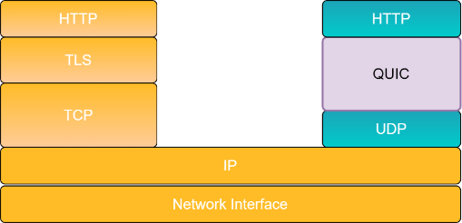

# QUIC

Como bien sabemos QUIC opera sobre UDP encargandose de los handshakes tanto UDP como TLS, para posteriormente realizar las request HTTP, utilizando la version 3 de este protocolo (HTTP/3).

# Links utiles

* [HTTP/3](https://www.cloudflare.com/es-es/learning/performance/what-is-http3/)
* [QUIC](https://blog.cloudflare.com/the-road-to-quic/) y mas [QUIC](https://blog.cloudflare.com/head-start-with-quic/)